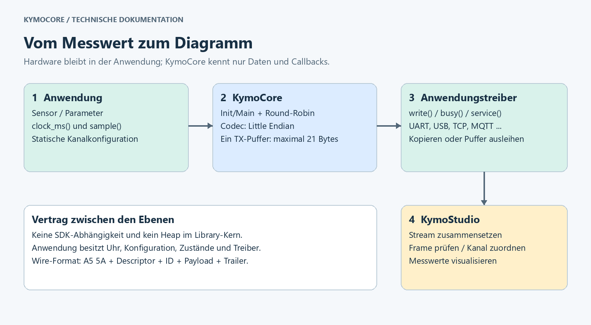

<p align="center">
  <a href="README.md"></a>
  <a href="README.de.md"></a>
</p>

<p align="center">
  <picture>
    <source media="(prefers-color-scheme: dark)" srcset="docs/images/kymotrace-logo-dark.svg">
    
  </picture>
</p>

<h3 align="center">KymoProbe · Die Firmware-Seite von Kymotrace</h3>

<p align="center">
  Fertige Firmware und Beispiele, die Messwerte von ESP32, Arduino und STM32 live an KymoStudio senden.
</p>

<p align="center">
  
  
  
</p>

---

## Worum geht es?

KymoProbe ist der schnellste Weg von einem Mikrocontroller zu **live
sichtbaren Messkurven**. Board flashen, in
[KymoStudio](https://github.com/CodeName-666/kymostudio) verbinden, und nach
wenigen Minuten laufen die Daten über den Bildschirm. Danach ersetzt du die
Testsignale durch deine eigenen Sensoren, Regelgrößen oder Zustände.

Unter der Haube arbeitet [KymoCore](https://github.com/CodeName-666/kymocore),
eine schlanke Library ohne Heap und ohne RTOS. Sie plant die Messungen, kodiert
sie in 9 bis 21 Bytes und schickt sie über die Schnittstelle deiner Wahl.
KymoProbe zeigt, wie das auf echter Hardware aussieht: per UART, USB, WLAN
oder MQTT.

<p align="center">
  
  <br><sub>So kommen die Daten an: Zeitverlauf und XY-Bahn in KymoStudio.</sub>
</p>

## In drei Schritten zu Live-Daten

```sh
# 1. Mit Submodulen klonen (KymoCore liegt in lib/KymoCore)
git clone --recurse-submodules https://github.com/CodeName-666/kymoprobe.git

# 2. ESP32 bauen und flashen
pio run -e nodemcu-32s -t upload

# 3. In KymoStudio eine serielle Verbindung öffnen: 115200 Baud, 8N1
```

Das Board sendet zwei Testsignale (Sinus und Sägezahn, je 50 Hz). KymoStudio
erkennt die Binärframes automatisch. Wichtig: Den seriellen Monitor von
PlatformIO vorher schließen.

## Eigene Messwerte senden

Alles, was du anpassen musst, steht in einer Datei:
[`src/kymo_config.cpp`](src/kymo_config.cpp). Dort legst du Kanäle und
Abtastintervalle fest und lieferst den Messwert:

```cpp
static uint8_t sample(void *, uint8_t id, KymoSample *out)
{
    out->value = id == 0 ? readTemperature() : readPressure();  // deine Sensoren
    return 1;
}

static const KymoChannel channels[] = {
    {20, 0, 0},   // Kanal 0 alle 20 ms
    {100, 1, 0}   // Kanal 1 alle 100 ms
};
```

Die Hauptschleife bleibt dabei winzig: Einmal `Kymo_Init()`, danach in jedem
Durchlauf `Kymo_Main()`. KymoCore entscheidet, welcher Kanal fällig ist, und
wartet nie auf die Schnittstelle.

## Was enthalten ist

| Beispiel | Hardware | Zeigt |
|---|---|---|
| [Hauptprojekt](src/) | ESP32 (NodeMCU-32S) | minimale Konfiguration über UART |
| [simple_analog_example](examples/arduino/simple_analog_example/) | Arduino Uno, Nano, Mega | ein Analogwert, so einfach wie möglich |
| [multi_sensor_example](examples/arduino/multi_sensor_example/) | Arduino Uno, Nano, Mega | Y, XY und XYZ mit unterschiedlichen Raten |
| [serial_example](examples/esp32/serial_example/) | ESP32, ESP32-S3, ESP32-C3 | serielle Übertragung mit Zeitstempel |
| [wifi_mqtt_example](examples/esp32/wifi_mqtt_example/) | ESP32, ESP32-S3 | kabellos per WLAN und MQTT-Broker |
| [stm32/uart_example](examples/stm32/uart_example/) | Nucleo F401RE, F411RE, Blue Pill | UART mit STM32-HAL |
| [stm32/usb_cdc_example](examples/stm32/usb_cdc_example/) | Blue Pill F103C8 | virtueller COM-Port über USB-CDC |
| [native](examples/native/) | PC | Frames ohne Hardware erzeugen |

Alle Beispiele sind gebaut und geprüft; die wichtigsten baut die CI bei jedem Push automatisch.

## Wofür man es einsetzt

- **Regler einstellen:** Soll- und Istwert eines PID-Reglers live vergleichen.
- **Sensoren testen:** Rauschen, Drift und Ansprechverhalten direkt sehen.
- **Antriebe und Leistungselektronik:** Strom, Drehzahl und Position mit Zeitstempel verfolgen.
- **Kabellos messen:** Mit dem MQTT-Beispiel Daten von bewegten oder entfernten Geräten empfangen.
- **Lernen und Basteln:** Messdaten anschaulich machen, statt Zahlenkolonnen im Terminal zu lesen.

## So hängt alles zusammen



| Projekt | Rolle |
|---|---|
| [KymoCore](https://github.com/CodeName-666/kymocore) | Library: Messwerte planen, kodieren, senden (hier als Submodul `lib/KymoCore`) |
| **[KymoProbe](https://github.com/CodeName-666/kymoprobe)** | dieses Repository: Firmware und Hardwarebeispiele |
| [KymoStudio](https://github.com/CodeName-666/kymostudio) | Desktop-App: empfangen, darstellen, analysieren, exportieren |

## Dokumentation

- **[Handbuch](docs/MANUAL.de.md):** Einrichtung, Beispiele, Architektur, C-/C++-API und Prüfung
- **[KymoCore-Anleitung](https://github.com/CodeName-666/kymocore/blob/main/docs/GUIDE.de.md):** Konfiguration, Features, Transporte
- **[Protokoll](https://github.com/CodeName-666/kymocore/blob/main/PROTOCOL.md):** Byte-Aufbau der Frames
- **[Beispiele im Detail](examples/README.md)** · **[Prüfergebnisse](docs/verification.md)** · **[Mitmachen](CONTRIBUTING.de.md)**

## Lizenz

Copyright (c) 2026 Christof Seidel. KymoProbe und die Library KymoCore sind
doppelt lizenziert: **GPLv3** ([LICENSE](LICENSE)), kostenlos für Hobby,
Basteln, Lernen und Open Source, oder eine **kommerzielle Lizenz** für
Unternehmen, die Firmware oder Geräte weitergeben, ohne ihren Quellcode
offenzulegen. Details stehen in [COMMERCIAL.md](COMMERCIAL.de.md). `lib/Events`
steht unter der MIT-Lizenz.
