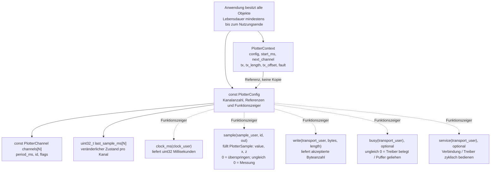
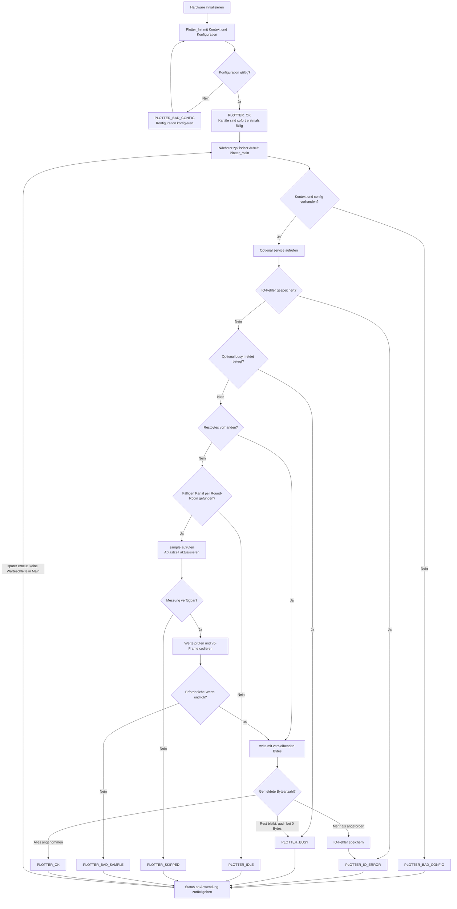
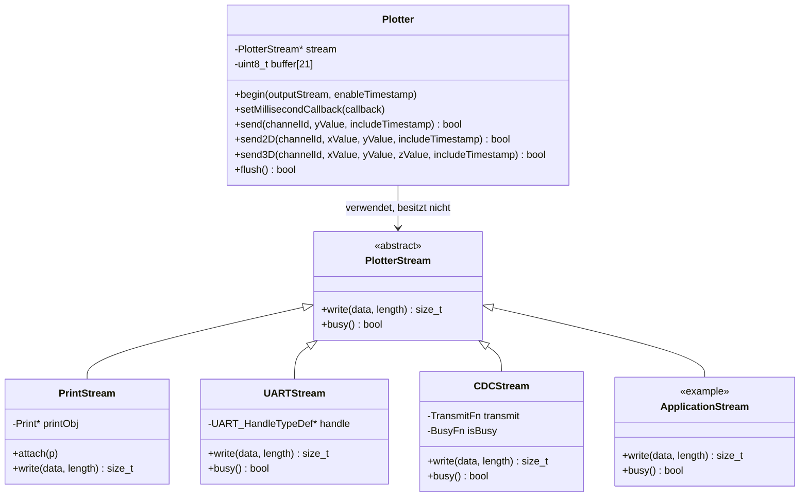
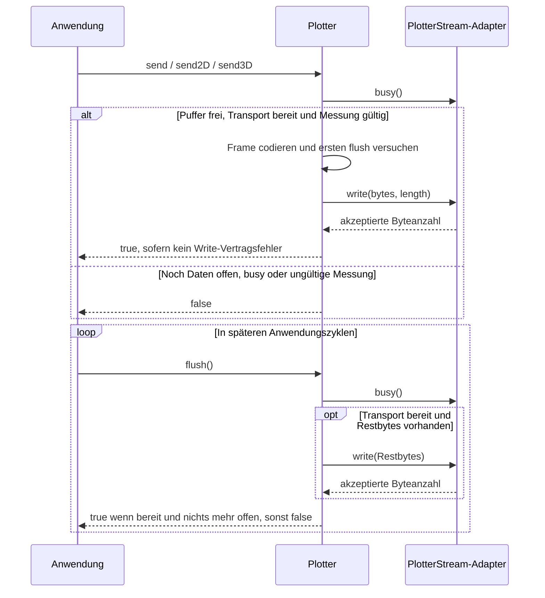

# PlotterEcu

Universelle Embedded-Telemetrie für PlotterApp: C++11-Kern, statische Konfiguration,
einmal `Plotter_Init()` und zyklisch `Plotter_Main()`. Das Hauptprojekt ist ein
ESP32-PlatformIO-Projekt. Der Kern benötigt weder Arduino noch RTOS oder Heap.

## Start mit ESP32

```sh
pio run -e nodemcu-32s
pio run -e nodemcu-32s -t upload
```

`src/main.cpp` initialisiert Serial mit **115200 Baud** und ruft Init/Main auf.
`src/plotter_config.cpp` enthält Kanäle, Abtastintervalle, Messwertfunktion und
Transport. Im Beispiel senden Kanal 0 und 1 Sinus/Sägezahn mit je 50 Hz und
Zeitstempeln. Eigene Messwerte werden im `sample`-Callback übernommen.

In PlotterApp eine serielle Verbindung zum Board mit **115200, 8N1** öffnen.
Die App erkennt die Binärframes automatisch. Die Datenbytes sind kein Text;
den Port nicht gleichzeitig mit dem PlatformIO-Serial-Monitor öffnen.
Kanalnamen/Einheiten werden in der App eingestellt, nicht über v6 übertragen.

## Arduino

```sh
pio run -d examples/arduino/simple_analog_example -e uno
pio run -d examples/arduino/simple_analog_example -e uno -t upload
pio run -d examples/arduino/multi_sensor_example -e uno
```

Die Beispiele erzeugen reproduzierbare Testsignale. Im gemeinsamen
`examples/common/arduino_serial_config.h` kann `example_sample` durch
`analogRead()` oder eigene Sensorwerte ersetzt werden. Das zweite Beispiel
zeigt Y, X/Y und X/Y/Z mit unabhängigen Abtastraten. Arduino Uno/Nano/Mega
und ESP32-Projekte nutzen denselben C++11-Kern.

## Library und Schnittstellen

Die vollständige Header-API lässt sich mit `doxygen Doxyfile` erzeugen.
[Doxygen-Anleitung](docs/doxygen.md) beschreibt Ausgabe und Dokumentationsregeln.

[PlotterLib](lib/PlotterLib/README.md) dokumentiert die Konfiguration, Speicher-
und Callback-Verträge. [PROTOCOL.md](lib/PlotterLib/PROTOCOL.md) definiert das
mit PlotterApp identische Wire-Format. Es sind 9–21 Bytes pro Messung:
bytebasierte IDs/Flags, explizites Little Endian, float32, optionale uint32-
Millisekunden und ein Abschlussbyte. CRC8 ist standardmäßig deaktiviert;
`NO_CRC` im Descriptor kennzeichnet Frames mit Null-Platzhalter statt CRC.
Mit `build_flags = -DPLOTTER_ENABLE_CRC=1` lässt sich CRC für den Bibliotheksbuild
einschalten. Für den Standardmodus ist die aktualisierte PlotterApp erforderlich.
Keine Pointer oder C-Strukturen werden direkt gesendet.

Der Standardbuild enthält nur den skalaren C-Sender und die Init/Main-Runtime.
X, Z, Zeitstempel, CRC, MCU-Decoder und C++-Wrapper werden über die
`PLOTTER_ENABLE_*`-Schalter in
[`plotter_build_config.h`](lib/PlotterLib/src/plotter_build_config.h) zugeschaltet:
direkt im Header `0` für aus oder `1` für ein setzen und vollständig neu bauen.
Vorhandene Build-Flags haben Vorrang vor den Headerwerten. Auch die Runtime
lässt sich für reine Codec-Nutzung abschalten. Die vollständige Schaltertabelle
steht in [PlotterLib/README.md](lib/PlotterLib/README.md#minimal-build-and-optional-features).
Die Beispielprojekte aktivieren ihre benötigten Extras ausdrücklich.

Für andere ECUs werden ausschließlich Zeit-, Mess- und Transport-Callbacks
angepasst. UART, USB CDC, TCP oder MQTT brauchen keinen anderen Codec.
Asynchrone Treiber melden Busy, bis der übergebene Puffer nicht mehr verwendet
wird. Kurze Writes werden beim nächsten Main fortgesetzt. Classic CAN benötigt
sein natives Mapping; ein v6-Frame passt erst in CAN-FD.

## Verwendung und Architektur

Die folgenden Mermaid-Diagramme werden auf GitHub und in Markdown-Viewern mit
Mermaid-Unterstützung dargestellt. Der bevorzugte Einstieg ist die C-Runtime:
Die Anwendung stellt eine statische Konfiguration bereit, initialisiert einmal
und ruft danach zyklisch `Plotter_Main()` auf. Die optionale C++-API ist ein
separater Sender für Anwendungen, die Messungen selbst zeitlich steuern.

### Datenweg: Anwendung bis PlotterApp

```mermaid
flowchart LR
    subgraph ECU["ECU / Firmware"]
        direction TB
        Values["Sensoren und Anwendungsparameter"]
        Config["plotter_config.c / .cpp<br/>Kanäle, Perioden, Flags, Callbacks"]
        Task["setup / Systemstart: Plotter_Init<br/>loop / zyklischer Task: Plotter_Main"]
        Runtime["C++11-Runtime<br/>Zeitplanung und Teilübertragungen"]
        Codec["v6-Codec<br/>Little Endian, float32, optionale CRC8"]
        Buffer["PlotterContext.tx<br/>maximal 21 Bytes"]
        Driver["Anwendungsadapter / Treiber<br/>UART, USB, TCP oder MQTT"]
        Config --> Task
        Task --> Runtime
        Values -->|sample| Runtime
        Runtime --> Codec
        Codec --> Buffer
        Buffer -->|write| Driver
        Driver -->|akzeptierte Bytes / busy| Runtime
    end
    subgraph PC["PC: PlotterApp"]
        Receive["Verbindung empfängt Bytes"]
        Decode["Frames erkennen und prüfen<br/>Länge, Descriptor, optionale CRC"]
        Route["Messwerte nach Kanal-ID zuordnen<br/>Y, optional X / Z / Zeit"]
        View["Darstellung im Plotter"]
        Receive --> Decode --> Route --> View
    end
    Driver -->|"binäres v6: 9 bis 21 Bytes"| Receive
```



Die Konfiguration ist eine kompilierte C-Struktur, keine zur Laufzeit gelesene
Datei. Die Anwendung initialisiert Hardware und Verbindungen. Der Codec
serialisiert einzelne Werte; er überträgt keine Speicherabbilder von Strukturen.

### C-Runtime: Konfiguration, Speicher und Callback-Zugriffe



`clock_user`, `sample_user` und `transport_user` transportieren eigene
Anwendungszustände oder Treiber-Handles als `void *`. So benötigt die Library
keine CPU-spezifischen Typen. Die C-Strukturen verwenden **keine Vererbung**.
Jede Runtime-Instanz benötigt einen eigenen `PlotterContext` und ein eigenes
`last_sample_ms`-Array. Konfiguration und Kanaltabelle bleiben nach Init konstant.

| Schnittstelle | Aufgabe der Anwendung | Aufgabe der Library |
| --- | --- | --- |
| `clock_ms` | Monotone Millisekundenzeit liefern | Fälligkeit und relative Zeitstempel berechnen |
| `sample` | Werte für die angefragte Kanal-ID in `out` schreiben | Höchstens eine Messung pro Main-Aufruf anfordern |
| `write` | Bytes annehmen und die tatsächliche Anzahl melden | Nicht angenommene Bytes später erneut anbieten |
| `busy` | Belegung und geliehene Puffer melden | Puffer währenddessen nicht verändern |
| `service` | Begrenzte Treiber-/Verbindungsarbeit erledigen | Einmal pro gültigem Main-Aufruf aufrufen, auch bei Busy oder gespeichertem Fehler |

### Zyklischer Ablauf und Rückgabestatus



`PLOTTER_OK` bedeutet, dass der Treiber den vollständigen Frame angenommen hat;
es ist keine Empfangsbestätigung der PlotterApp. Bei DMA oder USB muss `busy`
so lange gesetzt bleiben, wie der Treiber den Puffer benutzt. Ein gespeicherter
IO-Fehler erfordert eine Treiberkorrektur und sichere Neuinitialisierung.
Verpasste Abtastungen werden nicht als nachträglicher Messwertstapel aufgeholt.

### Usage: vorhandene ESP32-Konfiguration verwenden

Dieses Beispiel verwendet die bereits definierte `plotter_config` aus
[src/plotter_config.cpp](src/plotter_config.cpp). Dort werden eigene Kanäle,
Messwertzugriffe und Transport-Callbacks angepasst.

```cpp
#include <Arduino.h>
#include "plotter_config.h"

static PlotterContext context;
static PlotterStatus init_status = PLOTTER_BAD_CONFIG;
static PlotterStatus last_status = PLOTTER_IDLE;

void setup()
{
    Serial.begin(115200);
    init_status = Plotter_Init(&context, &plotter_config);
}

void loop()
{
    if (init_status == PLOTTER_OK) {
        last_status = Plotter_Main(&context);
        // last_status bei Bedarf in der Anwendungsdiagnose auswerten.
    }
    // Weitere begrenzte Anwendungsarbeit erledigen.
}
```

Für eine andere ECU bleiben Init/Main und die Datenstrukturen gleich. Ersetzt
werden Hardwareinitialisierung und Callbacks. Diagnoseausgaben dürfen nicht in
denselben binären Datenstrom geschrieben werden. Aufrufe erfolgen aus einem
Task und nicht gleichzeitig aus Interrupts oder mehreren Threads.

### Optionale C++-API: Vererbung und Verwendung



Die Pfeile mit leerer Dreiecksspitze zeigen Vererbung. `Plotter` hält einen
Zeiger auf `PlotterStream`; er erbt nicht davon und löscht den Stream nicht.
`ApplicationStream` ist eine mögliche eigene Implementierung, keine vorhandene
Projektklasse. Die Methodenliste zeigt die wesentlichen Schnittstellen; die
Header dokumentieren alle Überladungen.

`PlotterStream::write()` ist rein virtuell. `busy()` hat eine Standardimplementierung
mit `false`; asynchrone Adapter müssen sie passend überschreiben. `PrintStream`
liegt in `examples/common/plotter_arduino.h`, die STM32-Beispieladapter liegen in
`examples/stm32/adapters/plotter_stm32.h`. Nur Anwendung und Adapter binden SDKs
ein; `Plotter` und `PlotterStream` bleiben plattformunabhängig.



Bei dieser API übernimmt die Anwendung die Abtastplanung. Ein erfolgreiches
`send*()` bedeutet Aufnahme in den Sendepuffer; kurze Writes werden durch
spätere `flush()`-Aufrufe abgeschlossen. Die Überladungen ohne
`includeTimestamp` senden ohne Zeitstempel. Für Zeitstempel muss zusätzlich
zur aktivierten Zeitstempeloption ein Millisekunden-Callback gesetzt sein.
Die C++-API verwendet denselben Codec wie die C-Runtime, ruft aber weder
`Plotter_Init` noch `Plotter_Main` auf.

## Prüfung

```sh
python tools/test_native.py --app ../PlotterApp
# Alternativ: nur C/C++-Tests ohne App
python tools/test_native.py
```

Benötigt gcc/g++. Unter Windows findet das Skript auch die PlatformIO-Toolchain:
`pio pkg install -g -t platformio/toolchain-gccmingw32`.
Die Prüfung kompiliert C99 und C++11 mit Warnungen als Fehler und prüft echte
C-Senderbytes gegen den Python-Decoder/Parser. Die App-Gesamtsuite kann im
App-Verzeichnis mit `python -m pytest -q` ausgeführt werden.

Weitere Beispiele und Build-Kommandos: [examples](examples/README.md).
Analyse/Entscheidungen: [docs/embedded-design.md](docs/embedded-design.md).
Prüfergebnisse: [docs/verification.md](docs/verification.md).

Der frühere A5A5-Prototyp wurde nach `legacy/` verschoben. Er wird nicht mehr
gebaut und ist nicht mit PlotterApp v6 kompatibel. Das unabhängige Events-
Submodul bleibt unverändert und ist keine Library-Abhängigkeit.

## Embedded-Coderegeln

Aktive C/C++-Funktionen verwenden höchstens ein `return` am Funktionsende.
Bitoperationen, Bytekonvertierung und CRC sind in einer unabhängigen
[Common-Komponente](lib/PlotterLib/src/common/README.md) gebündelt.
`python tools/test_native.py` prüft die Coderegel und die Hilfsfunktionen mit.
Die dauerhaften Vorgaben stehen in [AGENTS.md](AGENTS.md).
