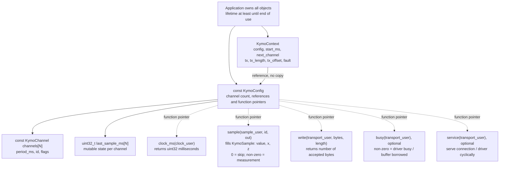
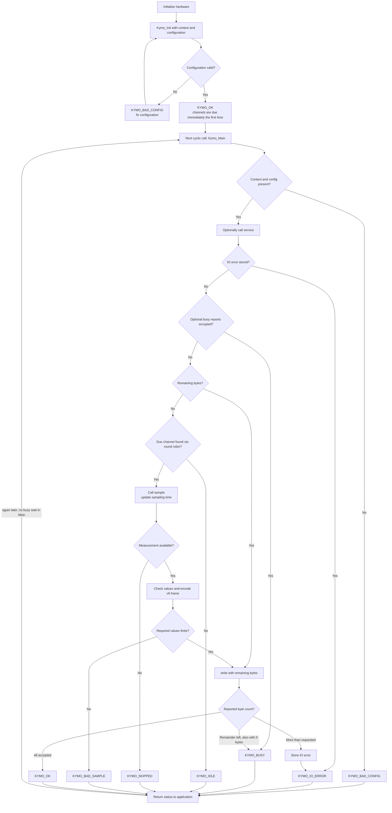
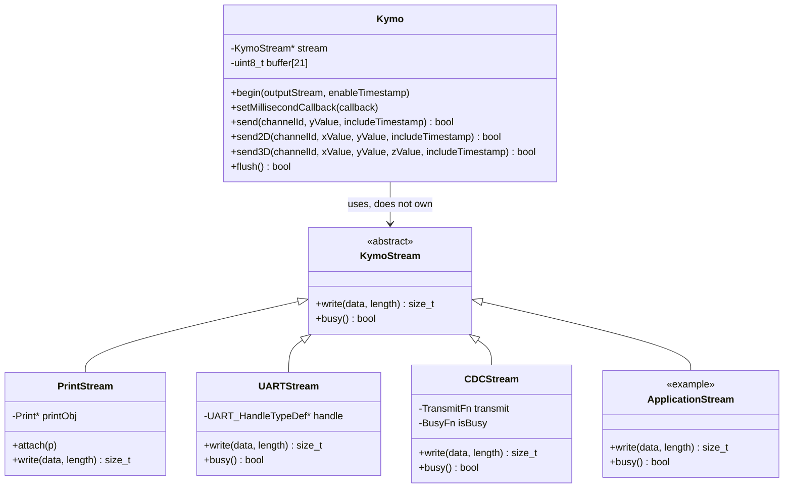
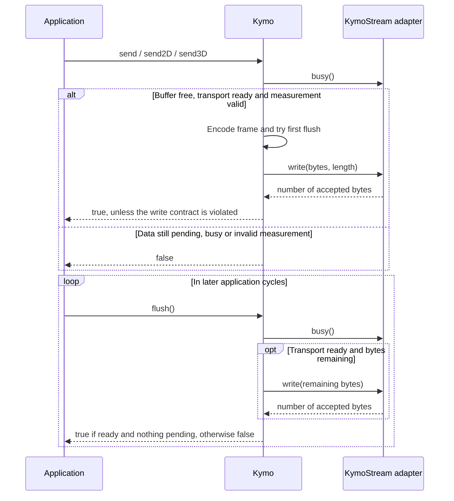

# KymoProbe – Manual

[← Back to overview](../README.md) · **English** · [Deutsch](MANUAL.de.md)

Setup, examples, architecture, C/C++ API and checks of the firmware in detail.

## Cloning

The KymoCore library is a separate repository
([CodeName-666/kymocore](https://github.com/CodeName-666/kymocore)) and is
included here as a Git submodule under `lib/KymoCore`. Therefore clone with
submodules:

```sh
git clone --recurse-submodules https://github.com/CodeName-666/kymoprobe.git
```

In an existing checkout, `git submodule update --init` is enough. Library
changes are committed, tagged and pushed in kymocore. Afterwards set the
submodule in this repository to the new tag:

```sh
git -C lib/KymoCore fetch --tags
git -C lib/KymoCore checkout v6.2.1   # desired version
git add lib/KymoCore && git commit -m "Update KymoCore to v6.2.1"
```

## Getting started with ESP32

```sh
pio run -e nodemcu-32s
pio run -e nodemcu-32s -t upload
```

`src/main.cpp` initialises Serial at **115200 baud** and calls Init/Main.
`src/kymo_config.cpp` contains channels, sampling intervals, the measurement
function and the transport. In the example, channels 0 and 1 send sine/sawtooth
at 50 Hz each with timestamps. Your own measurements go into the `sample`
callback.

In KymoStudio, open a serial connection to the board with **115200, 8N1**. The
app detects the binary frames automatically. The data bytes are not text; do
not open the port at the same time as the PlatformIO serial monitor. Channel
names/units are set in the app and are not transmitted via v6.

## Arduino

```sh
pio run -d examples/arduino/simple_analog_example -e uno
pio run -d examples/arduino/simple_analog_example -e uno -t upload
pio run -d examples/arduino/multi_sensor_example -e uno
```

The examples generate reproducible test signals. In the shared
`examples/common/arduino_serial_config.h`, `example_sample` can be replaced with
`analogRead()` or your own sensor values. The second example shows Y, X/Y and
X/Y/Z with independent sampling rates. Arduino Uno/Nano/Mega and ESP32 projects
use the same C++11 core.

## Library and interfaces

The complete header API can be generated with `doxygen Doxyfile`. The
[Doxygen guide](doxygen.md) (German) describes the output and documentation
rules.

[KymoCore](https://github.com/CodeName-666/kymocore/blob/main/docs/GUIDE.md)
(separate repository, submodule) documents the configuration, memory and
callback contracts. [PROTOCOL.md](https://github.com/CodeName-666/kymocore/blob/main/PROTOCOL.md)
defines the wire format, identical to KymoStudio. It uses 9–21 bytes per
measurement: byte-based IDs/flags, explicit little endian, float32, optional
uint32 milliseconds and a trailing byte. CRC8 is disabled by default; `NO_CRC`
in the descriptor marks frames with a zero placeholder instead of a CRC.
`build_flags = -DKYMO_ENABLE_CRC=1` enables CRC for the library build. The
default mode requires the updated KymoStudio. No pointers or C structures are
sent directly.

The default build contains only the scalar C sender and the Init/Main runtime.
X, Z, timestamps, CRC, the MCU decoder and the C++ wrapper are enabled via the
`KYMO_ENABLE_*` switches in
[`kymo_build_config.h`](https://github.com/CodeName-666/kymocore/blob/main/src/kymo_build_config.h):
set `0` for off or `1` for on directly in the header and rebuild completely.
Existing build flags take precedence over the header values. The runtime can
also be disabled for codec-only use. The complete switch table is in the
[KymoCore guide](https://github.com/CodeName-666/kymocore/blob/main/docs/GUIDE.md#minimal-build-and-optional-features).
The example projects enable the extras they need explicitly.

For other ECUs only the time, measurement and transport callbacks are adapted.
UART, USB CDC, TCP or MQTT need no different codec. Asynchronous drivers report
busy until the handed-over buffer is no longer in use. Short writes continue on
the next Main call. Classic CAN needs its native mapping; a v6 frame only fits
into CAN FD.

## Usage and architecture

The following Mermaid diagrams are rendered on GitHub and in Markdown viewers
with Mermaid support. The preferred entry point is the C runtime: the
application provides a static configuration, initialises once and then calls
`Kymo_Main()` cyclically. The optional C++ API is a separate sender for
applications that time their measurements themselves.

### Data path: application to KymoStudio

```mermaid
flowchart LR
    subgraph ECU["ECU / firmware"]
        direction TB
        Values["Sensors and application parameters"]
        Config["kymo_config.c / .cpp<br/>channels, periods, flags, callbacks"]
        Task["setup / system start: Kymo_Init<br/>loop / cyclic task: Kymo_Main"]
        Runtime["C++11 runtime<br/>scheduling and partial transfers"]
        Codec["v6 codec<br/>little endian, float32, optional CRC8"]
        Buffer["KymoContext.tx<br/>at most 21 bytes"]
        Driver["Application adapter / driver<br/>UART, USB, TCP or MQTT"]
        Config --> Task
        Task --> Runtime
        Values -->|sample| Runtime
        Runtime --> Codec
        Codec --> Buffer
        Buffer -->|write| Driver
        Driver -->|accepted bytes / busy| Runtime
    end
    subgraph PC["PC: KymoStudio"]
        Receive["Connection receives bytes"]
        Decode["Detect and check frames<br/>length, descriptor, optional CRC"]
        Route["Assign values by channel ID<br/>Y, optional X / Z / time"]
        View["Display in KymoStudio"]
        Receive --> Decode --> Route --> View
    end
    Driver -->|"binary v6: 9 to 21 bytes"| Receive
```



The configuration is a compiled C structure, not a file read at runtime. The
application initialises hardware and connections. The codec serialises
individual values; it does not transmit memory images of structures.

### C runtime: configuration, memory and callback access



`clock_user`, `sample_user` and `transport_user` carry your own application
state or driver handles as `void *`. That way the library needs no
CPU-specific types. The C structures use **no inheritance**. Each runtime
instance needs its own `KymoContext` and its own `last_sample_ms` array.
Configuration and channel table stay constant after Init.

| Interface | Application's job | Library's job |
| --- | --- | --- |
| `clock_ms` | Provide monotonic millisecond time | Compute due times and relative timestamps |
| `sample` | Write values for the requested channel ID into `out` | Request at most one measurement per Main call |
| `write` | Accept bytes and report the actual count | Offer bytes that were not accepted again later |
| `busy` | Report occupancy and borrowed buffers | Leave the buffer unchanged meanwhile |
| `service` | Do bounded driver/connection work | Call it once per valid Main call, even when busy or with a stored error |

### Cyclic flow and return status



`KYMO_OK` means that the driver accepted the complete frame; it is not a
receipt from KymoStudio. With DMA or USB, `busy` must stay set as long as the
driver uses the buffer. A stored IO error requires a driver fix and a safe
re-initialisation. Missed samples are not caught up as a batch of late
measurements.

### Usage: using the existing ESP32 configuration

This example uses the already defined `kymo_config` from
[src/kymo_config.cpp](../src/kymo_config.cpp). Your own channels, measurement
access and transport callbacks are adapted there.

```cpp
#include <Arduino.h>
#include "kymo_config.h"

static KymoContext context;
static KymoStatus init_status = KYMO_BAD_CONFIG;
static KymoStatus last_status = KYMO_IDLE;

void setup()
{
    Serial.begin(115200);
    init_status = Kymo_Init(&context, &kymo_config);
}

void loop()
{
    if (init_status == KYMO_OK) {
        last_status = Kymo_Main(&context);
        // Evaluate last_status in your application diagnostics if needed.
    }
    // Do further bounded application work.
}
```

For another ECU, Init/Main and the data structures stay the same. Hardware
initialisation and callbacks are replaced. Diagnostic output must not be
written into the same binary data stream. Calls come from one task and not
simultaneously from interrupts or several threads.

### Optional C++ API: inheritance and usage



Arrows with a hollow triangle show inheritance. `Kymo` holds a pointer to
`KymoStream`; it does not inherit from it and does not delete the stream.
`ApplicationStream` is a possible implementation of your own, not an existing
project class. The method list shows the essential interfaces; the headers
document all overloads.

`KymoStream::write()` is pure virtual. `busy()` has a default implementation
returning `false`; asynchronous adapters must override it appropriately.
`PrintStream` lives in `examples/common/kymo_arduino.h`, the STM32 example
adapters in `examples/stm32/adapters/kymo_stm32.h`. Only the application and
adapters include SDKs; `Kymo` and `KymoStream` remain platform-independent.



With this API the application does the sampling schedule. A successful
`send*()` means the frame was taken into the send buffer; short writes are
completed by later `flush()` calls. The overloads without `includeTimestamp`
send without timestamp. For timestamps, a millisecond callback must be set in
addition to the enabled timestamp option. The C++ API uses the same codec as
the C runtime but calls neither `Kymo_Init` nor `Kymo_Main`.

## Checks

```sh
python tools/test_native.py --app ../KymoStudio
# Alternatively: only C/C++ tests without the app
python tools/test_native.py
```

Requires gcc/g++. On Windows the script also finds the PlatformIO toolchain:
`pio pkg install -g -t platformio/toolchain-gccmingw32`. The check compiles
C99 and C++11 with warnings as errors and verifies real C sender bytes against
the Python decoder/parser. The full app suite can be run in the app directory
with `python -m pytest -q`.

More examples and build commands: [examples](../examples/README.md).
Analysis/decisions: [docs/embedded-design.md](embedded-design.md) (German).
Verification results: [docs/verification.md](verification.md) (German).

The former A5A5 prototype was moved to `legacy/`. It is no longer built and is
not compatible with KymoStudio v6. The independent Events submodule remains
unchanged and is not a library dependency.

## Embedded coding rules

Active C/C++ functions use at most one `return`, at the end of the function.
Bit operations, byte conversion and CRC are bundled in an independent
[common component](https://github.com/CodeName-666/kymocore/blob/main/src/common/README.md).
`python tools/test_native.py` also checks the coding rule and the helpers. The
permanent conventions are in [AGENTS.md](../AGENTS.md).
