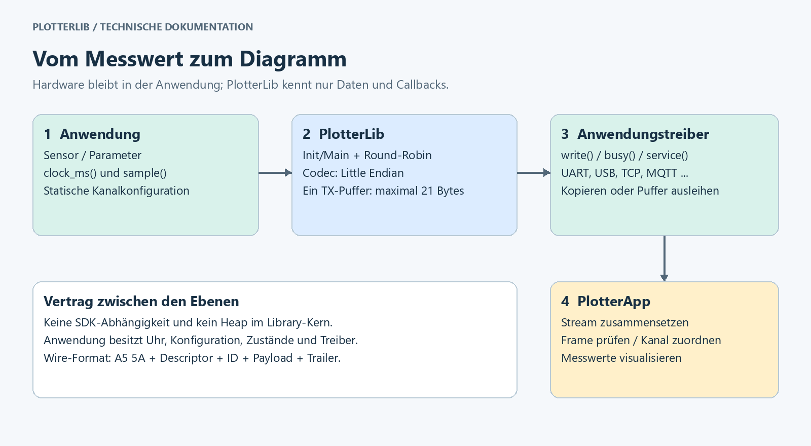
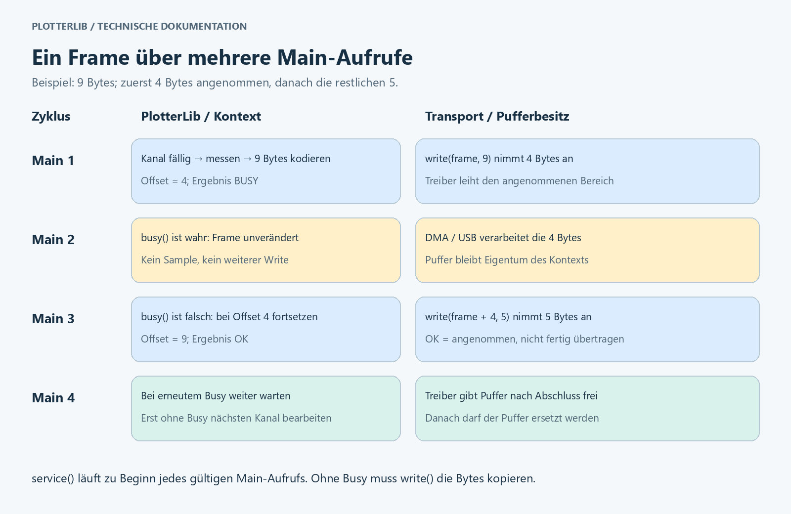

# PlotterLib — Embedded-Telemetrie für PlotterApp

PlotterLib überträgt Messwerte aus Mikrocontrollern an die
[PlotterApp](https://github.com/CodeName-666/plotterapp). Die Library erzeugt
Binärframes mit **9 bis 21 Bytes pro Messpunkt**. Ihr kooperativer Scheduler
fragt konfigurierte Kanäle ab und behandelt langsame Transporte,
Teilübertragungen und asynchron ausgeliehene Sendepuffer.

Der Kern ist plattformunabhängiges **C++11 mit C-kompatibler API**, ohne
Heap-Allokation, Exceptions, RTTI oder SDK-Abhängigkeiten. Arduino, ESP32 und
STM32 werden über anwendungsseitige Callbacks angebunden. Die Library enthält
keinen UART-, USB-, Netzwerk- oder CAN-Treiber.

**Paketversion:** 6.1.0 · **Protokoll:** v6.1 · **Wire-Version:** 1 ·
**Lizenz:** [MIT](LICENSE)

Diese Anleitung erklärt Einrichtung, Datenweg und Protokoll auf Deutsch.
Die anschließende englische API-Referenz beschreibt die technischen Verträge.
Die Registry-Installation gilt nach Veröffentlichung unter dem gewählten Owner.

## Architektur und Datenweg



Die Anwendung besitzt Messquellen, Uhr, Konfiguration und Transporttreiber.
`Plotter_Init` prüft die statische Konfiguration und bindet sie an einen Kontext.
`Plotter_Main` wählt einen fälligen Kanal, ruft den Messcallback auf, kodiert
den Messpunkt und bietet dem Transport die Bytes an. PlotterApp setzt
empfangene Fragmente zusammen und ordnet Messwerte anhand ihrer Kanal-ID zu.

| Ebene | Aufgabe | Schnittstelle |
|---|---|---|
| Anwendung | Sensoren, Hardwareinitialisierung und Verbindung | Eigene Treiber |
| Zeitquelle | Monotone Millisekunden liefern | `clock_ms(user)` |
| Messquelle | Y und bei Bedarf X/Z lesen | `sample(user, id, out)` |
| Scheduler | Fälligkeit, Round-Robin und Rückstau | `Plotter_Init`, `Plotter_Main` |
| Codec | Werte prüfen und Little-Endian-Frame erzeugen | `plotter_encode_data` |
| Transportadapter | Bytes kopieren oder kontrolliert ausleihen | `write`, optional `busy`/`service` |
| PlotterApp | Dekodieren, Signale darstellen und auswerten | [Desktop-Projekt](https://github.com/CodeName-666/plotterapp) |

Die optionale C++-Klasse `Plotter` ist ein alternativer Push-Sender: Die
Anwendung entscheidet selbst über den Sendezeitpunkt. Beide APIs verwenden
dasselbe Wire-Format. Es gibt keine Messwertwarteschlange im Kern.

## Installation mit PlatformIO

Nach Veröffentlichung `PIO_OWNER` durch den tatsächlichen PlatformIO-Benutzer
oder die Organisation ersetzen. Der GitHub-Name bestimmt diesen Namespace
nicht automatisch. `PIO_OWNER` ist ausdrücklich ein Platzhalter:

```ini
[env:esp32dev]
platform = espressif32@6.12.0
board = esp32dev
framework = arduino
monitor_speed = 115200
lib_deps =
    PIO_OWNER/PlotterLib @ 6.1.0
```

Für Uno stattdessen `platform = atmelavr@5.3.0` und `board = uno` setzen.
Die Library selbst ist weder an diese Boards noch an Arduino gebunden.

Vor Veröffentlichung im vollständigen PlotterEcu-Repository ein Paket bauen:

```sh
pio pkg pack lib/PlotterLib -o PlotterLib-6.1.0.tar.gz
```

Das Archiv in das eigene Projekt kopieren und dort eintragen:

```ini
lib_deps =
    file://PlotterLib-6.1.0.tar.gz
```

Alternativ den vollständigen Library-Ordner nach `lib/PlotterLib` des eigenen
Projekts kopieren. Ein Git-Link auf das gesamte PlotterEcu-Repo ist nicht
gleichbedeutend mit dem eigenständigen Paket: Die Library liegt dort im
Unterverzeichnis `lib/PlotterLib`. Für das Paket ist kein `lib/Events` nötig.

## Vollständiges Arduino- und ESP32-Beispiel

Folgender Inhalt für `src/main.cpp` sendet auf Kanal 0 alle 20 ms einen
synthetischen Sägezahn zwischen 0 und knapp 1. Er verwendet ausschließlich
die Standardeinstellungen. Die serielle Schnittstelle bleibt für Binärdaten
reserviert; Diagnoseausgaben würden denselben Datenstrom verändern.

```cpp
#include <Arduino.h>
#include <plotter_runtime.h>

static PlotterContext context = {};
static PlotterStatus lastStatus = PLOTTER_BAD_CONFIG;
static uint32_t lastSampleMs[1] = {};
static const PlotterChannel channels[] = {{20U, 0U, 0U}};

/*******************************************************************************
 * readClockMs
 ******************************************************************************/
static uint32_t readClockMs(void *user)
{
    uint32_t result = static_cast<uint32_t>(millis());
    (void)user;
    return result;
}

/*******************************************************************************
 * readSample
 ******************************************************************************/
static uint8_t readSample(void *user, uint8_t id, PlotterSample *out)
{
    uint8_t result = 0U;
    (void)user;
    (void)id;
    if (out != nullptr) {
        out->value = static_cast<float>(millis() % 1000UL) / 1000.0f;
        result = 1U;
    }
    return result;
}

/*******************************************************************************
 * writeBytes
 ******************************************************************************/
static uint8_t writeBytes(void *user, const uint8_t *bytes, uint8_t length)
{
    uint8_t result = 0U;
    int available = Serial.availableForWrite();
    (void)user;
    if ((bytes != nullptr) && (available > 0)) {
        if (available < length) {
            length = static_cast<uint8_t>(available);
        }
        result = static_cast<uint8_t>(Serial.write(bytes, length));
    }
    return result;
}

static const PlotterConfig config = {
    channels, lastSampleMs, readClockMs, nullptr, readSample, nullptr,
    writeBytes, nullptr, nullptr, nullptr, 1U
};

/*******************************************************************************
 * setup
 ******************************************************************************/
void setup()
{
    Serial.begin(115200);
    lastStatus = Plotter_Init(&context, &config);
}

/*******************************************************************************
 * loop
 ******************************************************************************/
void loop()
{
    if ((lastStatus != PLOTTER_BAD_CONFIG) && (lastStatus != PLOTTER_IO_ERROR)) {
        lastStatus = Plotter_Main(&context);
    }
}
```

`int available` folgt dem Rückgabetyp der Arduino-API; vor der Verengung wird
der Wertebereich geprüft. Serial kopiert die angenommenen Bytes; deshalb ist
hier kein Busy-Callback nötig. Die tatsächliche Ausführungszeit hängt vom
Serial-Treiber ab. Den Messcallback später durch den Sensorzugriff ersetzen.

Mit `pio run` bauen, anschließend mit `pio run -t upload` auf das angeschlossene
Board übertragen. PlotterApp mit 115200 Baud und 8N1 verbinden und Kanal 0
einem Diagramm zuordnen. Einen geöffneten seriellen Monitor vorher schließen.
Ein vollständig SDK-freies, ausführbares Beispiel liegt in
[examples/basic](examples/basic/README.md).

## Features und Konfiguration

Die Defaults ergeben einen skalaren Y-Sender mit Init/Main. Für installierte
Registry-Pakete sind projektweite `build_flags` die reproduzierbare Wahl:
Direkte Änderungen im installierten Paket können Updates überschreiben.
Bei Quellkopien lassen sich Defaults in `src/plotter_build_config.h` bearbeiten.
`plotter_features.h` validiert sie. Compilerdefinitionen haben Vorrang.

| Schalter | Default | Wirkung bei 1 |
|---|---:|---|
| `PLOTTER_ENABLE_RUNTIME` | 1 | Init/Main-Scheduler |
| `PLOTTER_ENABLE_X` | 0 | Optionale X-Koordinate |
| `PLOTTER_ENABLE_Z` | 0 | Optionale Z-Koordinate, unabhängig von X |
| `PLOTTER_ENABLE_TIMESTAMP` | 0 | Zeitstempel auf dem Draht |
| `PLOTTER_ENABLE_CRC` | 0 | Ausgehende CRC berechnen |
| `PLOTTER_ENABLE_DECODER` | 0 | Vollständige Frames auf dem MCU dekodieren |
| `PLOTTER_ENABLE_CPP` | 0 | C++-Push-Sender und Stream-Abstraktion |

Für XYZ mit Zeitstempel und CRC ergänzen:

```ini
build_flags =
    -DPLOTTER_ENABLE_X=1
    -DPLOTTER_ENABLE_Z=1
    -DPLOTTER_ENABLE_TIMESTAMP=1
    -DPLOTTER_ENABLE_CRC=1
```

Feature-Aktivierung erlaubt ein Feld; die Flags des jeweiligen Kanals wählen
es für dessen Frame aus. XYZ mit Zeitstempel verwendet `PLOTTER_ALLOWED_FLAGS`,
nur Zeitstempel `PLOTTER_FLAG_TIMESTAMP`. Der Callback setzt X/Z; die Runtime
berechnet die Zeit seit Init. Alle Einheiten gemeinsam neu bauen: Ein Define
allein im Sketch konfiguriert separat übersetzte Library-Dateien nicht.

Nur 0 und 1 sind erlaubt. Deaktivierte Implementierungen werden herauskompiliert.
Unzulässige Feldanforderungen werden abgewiesen, nicht still entfernt.
Öffentliche Datenlayouts bleiben gleich; die Schalter sparen hauptsächlich
Code. Der MCU-Decoder prüft geschützte Eingaben auch bei deaktivierter
ausgehender CRC. Der Desktop-Decoder ist von Firmware-Features unabhängig.

## Scheduling und Übertragungsablauf



Es sind 1–256 eindeutige Kanal-IDs möglich. Perioden reichen von 0 bis
`INT32_MAX` ms; 0 bedeutet bei jeder möglichen Auswahl. Nach Init sind alle
Kanäle sofort fällig. Main prüft höchstens N Kanäle und ruft höchstens einmal
den Messcallback und einmal Write auf. Round-Robin verhindert dauerhafte
Verdrängung. Main häufiger als die Summe der gewünschten Abtastraten aufrufen;
kurze Writes benötigen weitere Aufrufe.

Pro Kontext existiert **ein 21-Byte-TX-Puffer**, daneben weitere Kontextfelder
und **4 Bytes Scheduling-Zustand pro Kanal**. Der gesamte Kontext ist größer
als 21 Bytes und ABI-abhängig. Konfiguration, Stack und Treiberpuffer kommen hinzu.
Ein ausstehender Frame behält seinen Messwert. Danach werden aktuelle Werte
abgefragt; ausgefallene Abtastungen werden nicht rekonstruiert.

`write(user, bytes, length)` meldet die Anzahl angenommener Bytes. Null heißt
später erneut versuchen; ein kurzer Write verschiebt den Offset. Der nächste
Main-Aufruf setzt am Rest fort. Eine Rückgabe größer als die angeforderte
Länge verriegelt `PLOTTER_IO_ERROR` bis zur sicheren Neuinitialisierung.

Bei synchroner Übertragung muss der Callback angenommene Bytes vor Rückkehr
kopieren oder verbrauchen. Bei DMA/USB darf der Treiber den Zeiger behalten,
wenn `busy(user)` bis zur Freigabe ungleich null bleibt. Währenddessen wird
der Puffer nicht überschrieben. `PLOTTER_OK` bedeutet Annahme durch den Treiber,
nicht physische Fertigstellung oder Empfangsbestätigung. `service(user)` läuft
zu Beginn jedes gültigen Main-Aufrufs, auch bei Busy und verriegeltem Fehler.

Alle Konfigurationsdaten müssen die Nutzung überleben. Jede Instanz besitzt
ihren eigenen Kontext und ihr eigenes Zeitstempelarray. APIs sind nicht
reentrant; Task-/ISR-Synchronisierung übernimmt die Anwendung. Nicht neu
initialisieren oder zerstören, solange ein Treiber den Puffer leiht. Bei
Teilframes dürfen andere Produzenten keine Bytes in denselben Stream mischen.

## Protokoll und Byte-Aufbau


Paketversion 6.1.0, Protokoll v6.1 und **Wire-Version 1** sind unterschiedliche
Angaben. Der normative Vertrag steht in [PROTOCOL.md](PROTOCOL.md).

| Offset | Größe | Inhalt |
|---|---:|---|
| 0 | 1 Byte | Sync `A5` |
| 1 | 1 Byte | Sync `5A` |
| 2 | 1 Byte | Descriptor |
| 3 | 1 Byte | Kanal-ID 0–255 |
| 4 | 0/4 Bytes | Optionales X |
| 4 oder 8 | 4 Bytes | Y, immer vorhanden |
| nach Y | 0/4 Bytes | Optionales Z |
| nach Z beziehungsweise Y | 0/4 Bytes | Optionale Zeit in ms |
| letztes Byte | 1 Byte | CRC-8/ATM oder Null-Trailer |

Die Payload-Reihenfolge ist **X? → Y → Z? → Zeit?**. X/Y/Z sind endliche
IEEE-754-Float32-Werte; NaN und Unendlich werden abgewiesen. Zeit ist ein
unsigned 32-Bit-Millisekundenwert relativ zum Senderstart und läuft nach
ungefähr 49,7 Tagen über. Mehrbytewerte sind Little Endian: niederwertigstes
Byte zuerst. Es werden keine gepackten C-Strukturen direkt übertragen.

| Descriptorbits | Bedeutung |
|---|---|
| 7–6 | `01` = Wire-Version 1 |
| 5–4 | `00` = Messpunkt |
| 3 | X vorhanden |
| 2 | Z vorhanden |
| 1 | Zeitstempel vorhanden |
| 0 | `NO_CRC`: 1 ohne CRC, 0 mit CRC |

Gültig sind `0x40` bis `0x4F`: gerade Werte mit CRC, ungerade ohne CRC.
Andere Versionen und Nachrichtentypen werden abgewiesen. Firmware-Features
können die unterstützten Layouts weiter einschränken.

**Länge = 9 + 4 × (X vorhanden + Z vorhanden + Zeit vorhanden)**, wobei
jeder Summand 0 oder 1 ist. Ein separates Längenbyte ist nicht nötig.

| Layout | Ohne Zeit | Mit Zeit |
|---|---:|---:|
| Y | 9 Bytes | 13 Bytes |
| XY | 13 Bytes | 17 Bytes |
| YZ | 13 Bytes | 17 Bytes |
| XYZ | 17 Bytes | 21 Bytes |

### Konkrete Frames

Kanal 7, Y = 1,0, ohne Zeit und ohne CRC:

```text
A5 5A | 41 | 07 | 00 00 80 3F | 00
Sync    Desc ID   Y = 1.0        Trailer
```

`0x41 = 01000001`: Version 1, Messpunkt, keine optionalen Felder, NO_CRC
gesetzt. `00 00 80 3F` ist Little Endian für Float32 `0x3F800000`.
Mit CRC lautet der Frame `A5 5A 40 07 00 00 80 3F 54`.

Kanal 3, X = 1,25, Y = −2,5, Z = 9,0, Zeit = 1234 ms:

```text
A5 5A | 4F | 03 | 00 00 A0 3F | 00 00 20 C0 | 00 00 10 41 | D2 04 00 00 | 00
Sync    Desc ID   X = 1.25      Y = -2.5      Z = 9.0       Zeit = 1234   Trailer
```

Der volle Frame hat 21 Bytes. Mit CRC wird `4F` zu `4E` und das letzte Byte
zu `89`. Die Python-Datenpunkte der App repräsentieren die Wire-Millisekunden
als Sekunden: 1234 ms entsprechen 1,234 s.

### CRC und Wiederaufnahme

CRC ist standardmäßig deaktiviert. Der Sender setzt NO_CRC und schreibt
ein Null-Trailerbyte. Der Empfänger ignoriert dessen Wert. Sync-, Descriptor-,
Längen- und Endlichkeitsprüfungen bleiben aktiv, erkennen aber nicht jede
Beschädigung: Ein verfälschter endlicher Messwert kann passieren.

Mit `PLOTTER_ENABLE_CRC=1` gilt CRC-8/ATM: Polynom `0x07`, Startwert `0x00`,
keine Reflexion, XOR-out `0x00`. Geschützt werden **Descriptor, ID und Payload**;
Sync und CRC-Byte selbst sind ausgenommen. ASCII `123456789` ergibt `F4`.
Nach ungültigen Frames sucht der Desktop-Streamdecoder erneut nach `A5 5A`.
Read-Grenzen des Transports sind keine Framegrenzen.

Ältere v6.0-Empfänger akzeptieren NO_CRC nicht. Daher einen entsprechend
aktualisierten App-Stand verwenden oder CRC einschalten. Der aktuelle
Desktop-Decoder verarbeitet beide Modi auch gemischt. Der optionale
MCU-Decoder erwartet einen vollständigen Frame; er ist kein Streamassembler.

## Transporte und Dimensionierung

| Transport | Anbindung durch die Anwendung | Framing |
|---|---|---|
| UART / Serial | Kopierender Write oder DMA plus Busy | Teilframes möglich |
| USB CDC | Kopieren oder Puffer ausleihen plus Busy | USB-Pakete sind keine Framegrenzen |
| TCP | Socket-Write, optional Service | Zusammenhängender Bytestrom |
| MQTT | Netzwerkdienst und Publish-Callback | Ganzen Frame annehmen oder 0 melden |
| CAN-FD | Ganzen Frame in Datenfeld einbetten | Padding vor dem Dekodieren entfernen |
| Classic CAN | Eigenes kompaktes Mapping | Kein 9–21-Byte-Frame im 8-Byte-Paket |

Classic CAN verwendet eine Kanalzuordnung über Arbitration-ID beziehungsweise
Adapterkonfiguration und ein konfiguriertes Zahlenformat. Details stehen im
[Protokollvertrag](PROTOCOL.md#can). Netzwerkaufbau und Wiederverbindung gehören
zum Adapter. Das externe PubSubClient-Beispiel verbindet synchron und ist
deshalb kein Nachweis für einen harten Echtzeitzyklus.

UART mit 115200 Baud und 8N1 benötigt zehn Leitungsbits pro Byte. Theoretisch
sind 11.520 Bytes/s möglich: etwa 1.280 Y-Messpunkte/s oder 548 XYZ-Messpunkte/s
mit Zeitstempel, jeweils ohne weitere Pausen oder Treiberkosten. Zehn Kanäle
mit je 100 Hz benötigen als reine Y-Frames 9.000 Bytes/s; mit Zeitstempel
13.000 Bytes/s und damit mehr als dieser UART tragen kann. Messrate,
Main-Aufruffrequenz und Transport gemeinsam dimensionieren.

## PlotterApp verbinden

Die zugehörige Desktop-Anwendung ist
**[PlotterApp auf GitHub](https://github.com/CodeName-666/plotterapp)**.
Dort befinden sich Quellcode und Informationen zum jeweiligen Projektstand.
Die Library liefert Telemetrie; die App übernimmt Empfang und Visualisierung.

1. Einen App-Decoder mit v6.1/NO_CRC-Unterstützung verwenden oder Firmware-CRC
   aktivieren. Lokaler Entwicklungsstand und öffentliches Repo können abweichen.
2. Firmware übertragen und den Eingang in der App konfigurieren: beispielsweise
   Serial mit 115200 Baud/8N1 oder MQTT mit dem Topic des Publishers.
3. Die Kanal-ID einem Signal/Diagramm zuordnen. Y ist der Messwert; X/Z sind
   optionale Koordinaten. Ohne X wird kein gemessener X-Wert übertragen.
4. Zunächst die bekannte Beispielwellenform prüfen, dann Sensoren anbinden.

Das Protokoll überträgt keine Kanalnamen, Einheiten oder Sensorkonfigurationen.
Diese Zuordnung bleibt bei Anwendung und App. Ein Rückkanal für Steuerbefehle
ist nicht Teil von v6.1. Legacy-JSON kann die App zusätzlich empfangen;
PlotterLib kodiert binär.

## Paketstruktur und Prüfung

```text
PlotterLib/
  library.json             PlatformIO-Metadaten und Exportumfang
  library.properties       Arduino-Metadaten
  LICENSE                  MIT-Lizenztext
  README.md                Anleitung und API-Verträge
  PROTOCOL.md              Normativer Wire-Vertrag
  CHANGELOG.md             Änderungen und Migration
  PUBLISHING.md            Release-Vorbereitung für Maintainer
  src/                     Plattformunabhängiger Kern und Header
    common/                Bit-, Byte- und CRC-Helfer
  examples/basic/          SDK-freies ausführbares Beispiel
  docs/images/             Architektur- und Protokollbilder
```

Im vollständigen ECU-Repository prüfen folgende Befehle Verhalten und Paket:

```sh
python tools/test_native.py --app ../PlotterApp
python tools/test_package.py
```

Der Paketcheck baut separate Verbraucher aus dem Archiv und kompiliert das
Arduino-Beispiel dieser README. Native Tests prüfen unter anderem Featureprofile,
CRC, Scheduling und den echten App-Decoder. Builds ersetzen keine Boardtests,
Stackmessungen oder Zeitmessungen im Treiber. Eigene Adapter auf Zielhardware
validieren. Die Paketvorbereitung und noch nötigen Schritte stehen in
[PUBLISHING.md](PUBLISHING.md), Änderungen in [CHANGELOG.md](CHANGELOG.md).

## Technical API reference

The following reference specifies compiler, configuration and ownership contracts.

The recommended API is `plotter_runtime.h`. The entire implementation is built
as C++11 or newer, without heap allocation, exceptions or RTTI.
`plotter_protocol.h` exposes the standalone codec; `plotter.h` offers an optional
C++11 push sender. The codec and Init/Main headers retain C linkage, so existing
C99 applications and callbacks can still use the library.
Compile `plotter_runtime.cpp` / `plotter_protocol.cpp` with a C++11 compiler and
link mixed C/C++ applications with the C++ toolchain. PlatformIO sets the library
flags automatically; custom builds should use
`-std=c++11 -fno-exceptions -fno-rtti`. Arduino builds must provide C++11 or newer.
PlatformIO's framework/platform compatibility is unrestricted.

## Minimal build and optional features

The default build contains scalar Y encoding and the C++11 Init/Main runtime.
Optional implementations are excluded by the preprocessor, not merely disabled
at runtime. Edit the `PLOTTER_ENABLE_*` values directly in
**`src/plotter_build_config.h`**: `0` disables a feature, `1` enables it.
This header is included automatically by all library and application APIs;
no PlatformIO setting or sketch-local define is required. `plotter_features.h`
loads the configuration and checks the values.

| Build switch | Default | Enables |
| --- | --- | --- |
| `PLOTTER_ENABLE_RUNTIME` | `1` | Cooperative scheduling through Init/Main |
| `PLOTTER_ENABLE_X` | `0` | X coordinates / XY data |
| `PLOTTER_ENABLE_Z` | `0` | Z coordinates / YZ data, independently of X |
| `PLOTTER_ENABLE_TIMESTAMP` | `0` | Wire timestamps; scheduling still uses a clock |
| `PLOTTER_ENABLE_CRC` | `0` | CRC on outgoing frames |
| `PLOTTER_ENABLE_DECODER` | `0` | MCU decoding, including CRC verification |
| `PLOTTER_ENABLE_CPP` | `0` | Optional C++ push sender and stream abstraction |

Only `0` and `1` are accepted. Rebuild the entire library and application after
editing the header. No switch depends on the MCU.

Compiler definitions remain optional **overrides**: `-DPLOTTER_ENABLE_X=1`
takes precedence over the internal header through its `#ifndef` guards.
Apply overrides to **all library and application compilation units**. A define
in a sketch alone does not configure separately compiled library sources.
Remove matching `build_flags` entries when the internal header should control
those features; supplied examples explicitly override their required options.

For example, optional PlatformIO overrides for a timestamped XYZ sender with CRC:

```ini
build_flags =
    -DPLOTTER_ENABLE_X=1
    -DPLOTTER_ENABLE_Z=1
    -DPLOTTER_ENABLE_TIMESTAMP=1
    -DPLOTTER_ENABLE_CRC=1
```

Set `PLOTTER_ENABLE_RUNTIME=0` for an encoder-only build. For a C++ push sender
without the scheduler, also set `PLOTTER_ENABLE_CPP=1`. Decoder and C++/runtime
entrypoints are unavailable when their module is disabled. CRC code is absent
unless either outgoing CRC or MCU decoding is enabled. The enabled MCU decoder
still verifies protected legacy input even when outgoing CRC is disabled.

Disabled X/Z/time flags return zero from encoding, `PLOTTER_BAD_CONFIG` from
Init, and failure from decoding. C++ requests for disabled fields return false.
Fields are never silently removed. `PLOTTER_ALLOWED_FLAGS` describes the wire
protocol; `PLOTTER_SUPPORTED_FLAGS` describes this build. PlotterApp continues
to accept all wire layouts independently of firmware feature selection.

Buffer bounds, finite-value checks, short-write handling and asynchronous buffer
ownership remain mandatory. Public structures and the maximum 21-byte buffer
stay unchanged: these switches primarily reduce code, not allocated context RAM.
Unused modules may already be eliminated by a linker with section garbage
collection/LTO; feature switches also remove optional branches within used code.

## Static configuration

Define this in your application's `plotter_config.c` (or `.cpp`):

```c
#include <plotter_runtime.h>

static uint32_t clock_ms(void *user); /* your monotonic millisecond clock */
static uint8_t read_sample(void *user, uint8_t id, PlotterSample *out);
static uint8_t write_bytes(void *user, const uint8_t *bytes, uint8_t length);

static const PlotterChannel channels[] = {
    {20, 0, 0},
    {100, 1, 0}
};
static uint32_t last_sample_ms[2];
const PlotterConfig plotter_config = {
    channels, last_sample_ms, clock_ms, 0, read_sample, 0,
    write_bytes, 0, 0, 0, 2
};
```

Implement the three callbacks in that file. `read_sample` assigns `out->value`
and optional `out->x` / `out->z`; returning zero skips a measurement until its
next scheduled interval. It can read shared application parameters through
`sample_user`. The runtime zero-initializes all sample fields before calling it.
Hardware handles belong in `transport_user`; clocks can use `clock_user`.

Initialize hardware first, then call:

```c
static PlotterContext plotter;
if (Plotter_Init(&plotter, &plotter_config) != PLOTTER_OK) {
    /* handle invalid configuration */
}
/* From your existing cyclic task: */
PlotterStatus status = Plotter_Main(&plotter);
```

Config, channels and last_sample_ms must remain alive. Do not mutate config or
channels after Init. Every instance needs its own context and last_sample_ms
array. Hardware setup remains the application's responsibility. Configuration
is compiled data, not a runtime file requiring a filesystem/parser.

## Scheduling and memory

- 1–256 unique channel IDs; IDs, flags, status, TX lengths and offsets are bytes.
- Periods are uint32 milliseconds, limited to INT32_MAX; zero means every
  eligible Main invocation. First samples are due immediately.
- One fixed **21-byte TX buffer** per context and **4 bytes runtime state per
  channel**. Config is separate and immutable. No measurement queue or heap.
- At most one sample callback and one transport write per Main; at most N
  channel checks. Round-robin selection avoids starvation. Call Main faster
  than the sum of configured sample rates; short writes need additional calls.
- Slow transports apply backpressure. A pending frame retains its original
  value/timestamp; after it finishes, overdue channels sample current values.
  There is no attempt to replay missed samples or an unbounded catch-up burst.
- uint32 subtraction handles clock rollover. Invoke Main at least once within
  INT32_MAX ms. Wire timestamps wrap after approximately 49.7 days, per v6.
- All entrypoints are single-task/non-reentrant. Synchronize application values
  shared with interrupts. Do not reinitialize while DMA/USB borrows a buffer.
- Native pointer/numeric structs remain naturally aligned. Explicit byte
  encoding avoids packed structs, enum-width and endian dependencies. IEEE-754
  binary32 floats are required; do not enable finite-math-only/fast-math modes.

## Transport callbacks

`write(user, bytes, length)` returns **accepted bytes**, from zero to length.
Zero means retry later. Short writes resume at their remaining offset. A driver
must never consume bytes it reports as unaccepted. More than length is a
contract error: Main latches IO_ERROR until reinitialization after driver reset.

Synchronous drivers copy/consume bytes before returning. Asynchronous UART/DMA
or CubeMX CDC may borrow the pointer only with a `busy(user)` callback that
stays nonzero until completion. Main neither rewrites nor advances the pending
buffer while busy. A disconnected driver can also report busy. Never mix other
producers into the same byte stream while a frame is partially written.

Optional `service(user)` runs once at the beginning of every valid Main call,
including busy/faulted calls. Use it to maintain network connections. All
callbacks need bounded execution for real-time use; the core cannot make a
blocking driver asynchronous. The PubSubClient example has synchronous network
connection attempts and is therefore not suitable for hard real-time loops.

MQTT/CAN-FD adapters must accept an entire frame or return zero; individual
messages cannot contain arbitrary frame fragments. TCP/UART/USB streams allow
partial writes. CAN-FD padding must be removed before decoding a complete frame
in an adapter; Classic CAN uses the separate mapping described in PROTOCOL.md.

| Main result | Meaning |
| --- | --- |
| PLOTTER_OK | Complete frame accepted by driver; not a delivery acknowledgement |
| PLOTTER_IDLE | No sample due |
| PLOTTER_BUSY | Transport busy or a frame remains partially written |
| PLOTTER_SKIPPED | Sample callback returned zero |
| PLOTTER_BAD_SAMPLE | Non-finite required coordinate; measurement skipped |
| PLOTTER_BAD_CONFIG | Null/uninitialized context or invalid Init configuration |
| PLOTTER_IO_ERROR | Impossible write count; fault latched until repair/reinit |

## Optional C++ push API

Existing `Plotter`, `send`, `send2D`, `send3D`, and timestamp setup remain.
Compile with `PLOTTER_ENABLE_CPP=1` and enable the desired X/Z/time features.
`send*` now returns true when a point is accepted into the fixed buffer; false
means busy, invalid data, no transport, or a driver fault. After acceptance,
call `flush()` cyclically until true to finish any short write. A second point
is rejected while the first is pending. The cyclic C API handles this scheduling
automatically and is recommended for new integrations.

`PlotterStream::busy()` defaults to false, requiring write to copy the data.
Override it for borrowed buffers. Plotter instances are non-copyable; stop
transfers before begin/reinitialization or destruction.

The entire library, including C++ wrappers, has no vendor/SDK dependency or
conditional target API. It knows only standard C/C++ types, configured callbacks
and the abstract PlotterStream. The millisecond callback always returns uint32_t.

Hardware adapters belong to the application. Optional reference adapters are
outside the package, in `examples/common/plotter_arduino.h` and
`examples/stm32/adapters/plotter_stm32.h`. The supplied cyclic examples already
implement hardware access in their own configuration callbacks.

Migration for the earlier Arduino C++ convenience overload: use
`PrintStream stream(Serial); Plotter sender(stream);` after including the
application-side Arduino adapter. Direct `Plotter(Serial)` and `begin(Serial)`
are removed. Wrap millis() with `uint32_t clock_ms() { return millis(); }` when
passing it to the C++ timestamp setter. The C Init/Main API is unchanged.
Consumers of the old STM32 header must include the example/application adapter
from its new location. Recompile all C++ consumers after this interface cleanup.

## Compatibility and verification

The [wire contract](PROTOCOL.md) is **v6.1 / wire version 1**. CRC calculation
is **disabled by default** for C and C++ senders. Descriptor bit 0 marks NO_CRC;
the final byte remains present as a zero trailer, keeping frames at 9–21 bytes.
Decoders ignore that trailer for NO_CRC and still validate legacy CRC frames.

To enable sender CRC, compile the library with `-DPLOTTER_ENABLE_CRC=1` (PlatformIO:
`build_flags = -DPLOTTER_ENABLE_CRC=1`). A define only in the application source
does not configure separately compiled library code. No public type/layout changes.
Use the updated PlotterApp for the default mode; older receivers require CRC enabled.
The Python encoder also defaults to disabled; pass `crc_enabled=True` to enable it.

From the repository root: `python tools/test_native.py --app ../PlotterApp`.
Minimal and independent feature profiles are tested, including symbol absence
for disabled modules and rejection of invalid switch values. Full builds test
both CRC modes. This covers codec bounds/CRC/flags, round-robin scheduling, clock wrap, invalid
configuration, backpressure, asynchronous buffers, independent instances,
C++ compatibility and 256 real C-generated channels decoded by the app.

## Coding rules and shared utilities

All active first-party C/C++ functions have at most one return, as their final
statement at function-body scope. Void functions may have no return. Error
paths use initialized status variables and small helpers; no exit macros or
goto-based substitutes. The source rule is checked automatically by the native
test runner and hence CI. Archived prototypes and the independent Events
submodule are outside the active production scope.

The independent [common component](src/common/README.md) provides reusable
bit/bitset operations, little-endian byte conversion and generic CRC8. Constant
mask combinations use `EMB_U8_OR`; runtime helpers use typed static inline
functions with checked shift counts. They are bundled in the package, requiring
no separate framework or library installation. Macros are not assumed to be
faster than compiler-inlined functions.

The C decoder commits to the output structure only after complete validation;
invalid input leaves it unchanged. These conventions improve consistency and
reviewability, but do not constitute a safety-standard compliance claim.
